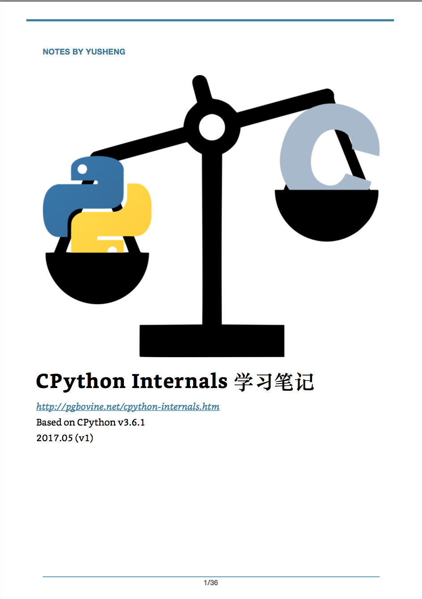

十小时学习 CPython 3.6 内部实现
===

---

Python 的官方实现版本 CPython 是 C 语言实现的，对于想要深入学习 Python 实现过程的人来说（比如说我），缺少时效性强的指导手册。有一本 08 年出版的《Python 源码剖析》，算是影响力最大的一本了，但是也已经比较久远了。而且现在 Python 已经发布到 3.6.2 版本了，与 Python 2.x 在很多地方已经存在相当大的差异。

除此之外，网上还有一份公开课，是 [Python Tutor - Visualize Python, Java, JavaScript, TypeScript, Ruby, C, and C++ code execution](http://www.pythontutor.com/) 的作者 [Philip Guo](http://www.pgbovine.net/) 2014 年所授课程 CSC 253 中的一部分：[CPython internals: A ten-hour codewalk through the Python interpreter source code](http://pgbovine.net/cpython-internals.htm)。本课程以 CPython 2.7.8 为例，共分为九节课，深入浅出地介绍了 CPython 的内部实现机制。根据本课程，前后花了大概十个小时的时间，我试着探索、学习了 CPython 3.6.1 的源码。我将每节课学习、探索的笔记整合起来，制作了这一本《CPython Internals 学习笔记》，开源分享至 [GitHub - rainyear/CPython-Internals-Lecture-Notes: CPython Internals 学习笔记](https://github.com/rainyear/CPython-Internals-Lecture-Notes)。

需要注意的是，并不是说你看完了这门课程就可以大刀阔斧地自己修改 CPython 的源码并重新编译一下用到生产环境中，如果你真的有改进 Python 的好想法，应该提出新的 [PEP](https://www.python.org/dev/peps/) 并提交 Commit。

欢迎分享、转载本书，但请务必保留对本项目的引用（[GitHub - rainyear/CPython-Internals-Lecture-Notes: CPython Internals 学习笔记](https://github.com/rainyear/CPython-Internals-Lecture-Notes)），且不得用于任何商业用途。如有任何疑问、意见，欢迎提交 [Issue](https://github.com/rainyear/CPython-Internals-Lecture-Notes/issues) 或发送邮件联系我！
